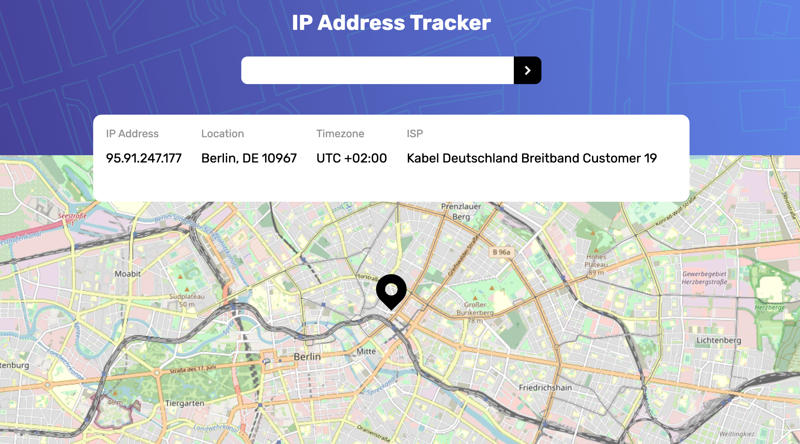

# Frontend Mentor - IP address tracker solution

This is a solution to the [IP address tracker challenge on Frontend Mentor](https://www.frontendmentor.io/challenges/ip-address-tracker-I8-0yYAH0). Frontend Mentor challenges help you improve your coding skills by building realistic projects. 

## Table of contents

- [Overview](#overview)
  - [The challenge](#the-challenge)
  - [Screenshot](#screenshot)
  - [Links](#links)
- [My process](#my-process)
  - [Built with](#built-with)
  - [What I learned](#what-i-learned)
- [Author](#author)
- [Acknowledgments](#acknowledgments)


## Overview

### The challenge

Users should be able to:

- View the optimal layout for each page depending on their device's screen size
- See hover states for all interactive elements on the page
- See their own IP address on the map on the initial page load
- Search for any IP addresses or domains and see the key information and location

### Screenshot




### Links

- Live Site URL: [site URL here](https://tamiriscss.github.io/ip-address-tracker-master/)

## My process

### Built with

- Semantic HTML5 markup
- CSS custom properties
- Flexbox
- Mobile-friendly
- JavaScript
- [LeafletJS](https://leafletjs.com/) To generate the map
- [IP Geolocation API by IPify](https://geo.ipify.org/)


### What I learned

```css
.info-box div {
    flex-grow: 1;
}
```
```js
fetch(`https://geo.ipify.org/api/v1?apiKey=${myApiKey}&ipAddress=${ipAddress}`)
    .then(res => res.json())
    .then(data => {
        lat = data.location.lat;
        lng = data.location.lng;
        displayIpInfos(data);
        displayMap();
    })
```


## Author

- Frontend Mentor - [@tamirisCss](https://www.frontendmentor.io/profile/TamirisCss)
